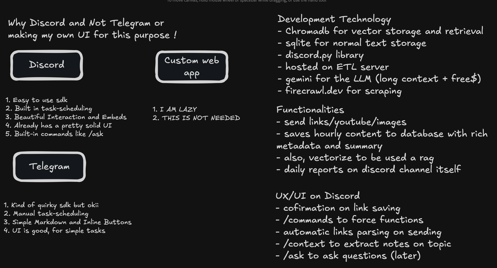
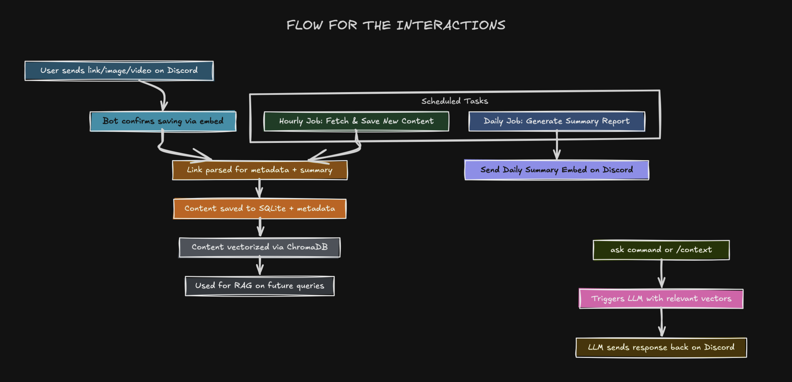

<!-- Discord Logo -->
<p align="center">
  
</p>

<h1 align="center">Discord Knowledge Bot</h1>

<p align="center">
  <a href="https://github.com/hiteshbandhu/discord-knowledge-bot/commits/master">
    
  </a>
  <a href="https://github.com/hiteshbandhu/discord-knowledge-bot/issues">
    
  </a>
  <a href="https://github.com/hiteshbandhu/discord-knowledge-bot/blob/master/LICENSE">
    
  </a>
  <a href="https://github.com/hiteshbandhu/discord-knowledge-bot">
    
  </a>
</p>

---

## Applications

Discord Knowledge Bot is designed for:
- Teams and communities who want to automatically collect, summarize, and organize knowledge from links, YouTube videos, and images shared in Discord channels.
- Building a searchable, chat-enabled knowledge base from channel content.
- Automating the extraction and summarization of shared resources for later reference or discussion.

---

## Architectural Decisions

Key decisions visible from the design:
- **Event-driven**: The bot reacts to Discord events (messages, attachments) for real-time processing.
- **Adapter pattern**: Abstracts different content sources (web, YouTube, images) behind a unified interface.
- **Strategy pattern**: Dynamically selects the appropriate extraction/summarization strategy based on content type.
- **Separation of concerns**: Discord interaction, scraping, summarization, and storage are modularized.
- **Extensibility**: New content types or summarization methods can be added with minimal changes to the core logic.
- **Error handling**: Robust error reporting and user feedback in Discord.



---

## Architecture

The following diagram illustrates the high-level system architecture:



---

## Component Breakdown

**Component explanations (as seen in the architecture diagram):**

- **Discord Bot (Event Handler):**
  - Listens for new messages and attachments in Discord channels.
  - Extracts URLs and image links from messages.

- **Link Type Detector:**
  - Determines the type of content (YouTube, image, generic link) using URL patterns.

- **Scraper/Adapter Layer:**
  - Uses the Adapter pattern to provide a unified interface for extracting content from different sources.
  - Each adapter (e.g., YouTube, Firecrawl, Image) implements a common `extract` method.

- **Summarization Service:**
  - Uses LLMs (e.g., Gemini) to generate summaries or descriptions for extracted content.

- **Database/Storage:**
  - Stores extracted and summarized content for later retrieval and chat-based querying.

- **Error Handling & Logging:**
  - Ensures all failures are logged and users receive clear feedback in Discord.

---

## Dependencies

**Major dependencies and their roles:**

| Dependency         | Purpose                                                                                 |
|--------------------|----------------------------------------------------------------------------------------|
| `discord.py`       | Core library for interacting with the Discord API.                                     |
| `firecrawl-py`     | Web scraping and content extraction from generic links.                                |
| `requests`         | HTTP requests for downloading images and other resources.                              |
| `google-genai`     | Access to Gemini LLM for summarization and image description.                          |
| `python-dotenv`    | Loads environment variables from `.env` files.                                         |
| `pydantic`         | Data validation and management for structured content models.                          |
| `fastapi`          | (If used) For any web server or API endpoints.                                         |
| `tqdm`, `rich`     | Progress bars and rich logging (for development/debugging).                            |
| `pytest`           | (If used) For testing adapters and other components.                                   |
| `chromadb`         | Vector database for semantic search and embeddings (ChromaDB, persisted locally).         |
| `psycopg2-binary`  | PostgreSQL driver for Python (used for NeonDB, not SQLite).                              |

*For a full list, see [`requirements.txt`](requirements.txt).*

### Required Environment Variables

| Key                | Description                                 |
|--------------------|---------------------------------------------|
| `DISCORD_TOKEN`    | Your Discord bot token                      |
| `FIRECRAWL_API_KEY`| API key for Firecrawl (web scraping)        |
| `GEMINI_API_KEY`   | API key for Gemini (LLM summarization)      |
| `NEON_DB_URL`      | Connection string for NeonDB (Postgres)     |

Add these to your `.env` file in the project root:
```
DISCORD_TOKEN=your_discord_bot_token
FIRECRAWL_API_KEY=your_firecrawl_api_key
GEMINI_API_KEY=your_gemini_api_key
NEON_DB_URL=your_neon_postgres_connection_url
```

---

## Setup Instructions

### Prerequisites
- Python 3.10 or higher
- A Discord account and a Discord server where you have permission to add bots

### 1. Clone the Repository
```bash
git clone https://github.com/hiteshbandhu/discord-knowledge-bot.git
cd discord-knowledge-bot
```

### 2. Create a Virtual Environment
```bash
python3 -m venv venv
source venv/bin/activate
```

### 3. Install Dependencies
```bash
pip install -r requirements.txt
```

### 4. Configure Environment Variables
- Create a `.env` file in the root directory with the required keys (see above).
- You may also need API keys for Firecrawl and Gemini, depending on your adapters.
- **For NeonDB (Postgres):** Set `NEON_DB_URL` to your NeonDB connection string.

### 5. Set Up Your Databases

#### NeonDB (Postgres)
- Run the migration script to create the required tables and indexes:
```bash
python src/database/scripts/migrate_to_neon_db.py
```
- This will connect to your NeonDB instance and set up the schema.

#### ChromaDB (Vector DB)
- ChromaDB is used for vector search and is persisted locally in `_data/vector_data_chroma`.
- No extra setup is needed; the database will be initialized automatically when you run the bot.
- **Setup precaution:** As a best practice, you can run the following command once to ensure the ChromaDB vector store and collection are initialized:
```bash
python src/database/chroma_db.py
```
- See `src/database/chroma_db.py` for details.

### 6. Set Up Your Discord Bot
- Follow the official Discord guide: [Setting Up a Discord Bot](https://discordpy.readthedocs.io/en/stable/discord.html)
- Ensure you enable the "Message Content Intent" in the Discord Developer Portal for your bot.

### 7. Run the Bot
```bash
python main.py
```

---

## License

This project is licensed under the MIT License.
